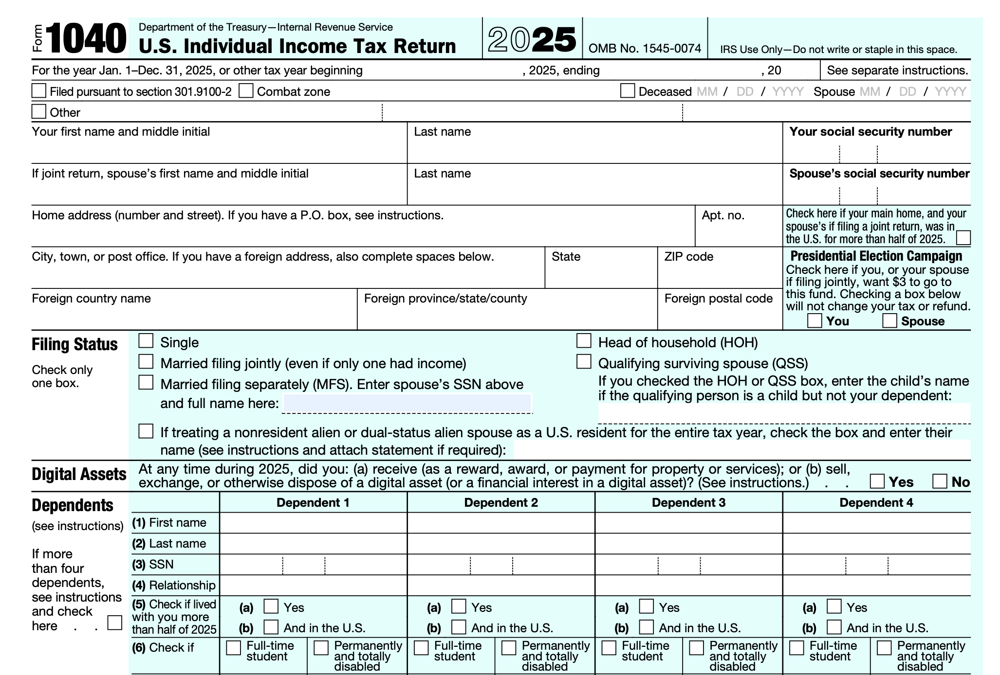

# Instead Annotation Engine

A configurable annotation engine that maps structured taxpayer data to IRS tax forms using a JSON-based annotation specification.

This project was developed as part of the **Instead Engineer Technical Assessment**.

---

# Problem Statement

Taxpayer information is typically stored as structured JSON, while IRS tax forms are fixed PDF templates containing predefined fields.

The objective of this project is to design a reusable annotation specification that acts as a contract between taxpayer data and a PDF rendering engine, allowing values to be accurately rendered onto IRS forms without hardcoding field positions inside application code.

---

# Solution Overview

The solution consists of a configurable annotation specification and a modular rendering pipeline.

```
                 Taxpayer JSON
                        │
                        ▼
            Annotation Specification
                        │
                        ▼
                  Resolver Module
                        │
                        ▼
                 Formatter Module
                        │
                        ▼
              Annotation Engine
                        │
                        ▼
                 PDF Renderer
                        │
                        ▼
                 Generated PDF
```

---

# Key Features

- JSON-based annotation specification
- Configuration-driven architecture
- Nested JSON data resolution
- PDF rendering using pdf-lib
- Field formatting (Text, Currency, Date, SSN)
- Modular architecture
- Easy to support new IRS forms
- Easy to support future tax years

---

# Project Structure

```
instead-annotation-spec/

├── annotation/
│   └── annotation-schema.json

├── docs/
│   ├── 01-Problem-Understanding.md
│   ├── 02-Annotation-Specification.md
│   ├── 03-Architecture.md
│   ├── 04-Design-Decisions.md
│   └── 05-Future-Enhancements.md

├── forms/
│   └── f1040.pdf

├── sample-data/
│   └── taxpayer.json

├── output/
│   └── output.pdf

├── src/
│   ├── resolver.js
│   ├── formatter.js
│   ├── annotationEngine.js
│   └── renderer.js

├── tests/
│   ├── testResolver.js
│   ├── testFormatter.js
│   └── testAnnotationEngine.js

├── package.json
└── README.md
```

---

# Documentation

Detailed documentation is available in the **docs/** directory.

- **01-Problem-Understanding.md** – Business problem and objectives
- **02-Annotation-Specification.md** – Annotation schema specification
- **03-Architecture.md** – System architecture
- **04-Design-Decisions.md** – Engineering decisions and trade-offs
- **05-Future-Enhancements.md** – Proposed future improvements

---

# How to Run

## Install dependencies

```bash
npm install
```

## Generate the PDF

```bash
npm start
```

Generated output:

```
output/output.pdf
```

---

# Sample Input

```
sample-data/taxpayer.json
```

Contains structured taxpayer information including:

- Taxpayer Details
- Income
- Deductions
- Dependents
- Bank Information

---

# Sample Annotation

```
annotation/annotation-schema.json
```

Contains:

- Field positions
- Data references
- Formatting rules
- Rendering behavior

---


# Output Preview

## Original IRS Form



---

## Generated PDF


# Technologies Used

- Node.js
- JavaScript
- pdf-lib

---

# Future Improvements

This architecture is designed to support future enhancements including:

- Visual Annotation Editor
- Automatic Coordinate Detection
- Aggregation Functions
- Full JSONPath Support
- Automatic Font Scaling
- Checkbox Support
- Annotation Validation
- Multiple IRS Forms
- Annotation Versioning

See **docs/05-Future-Enhancements.md** for more details.

---


